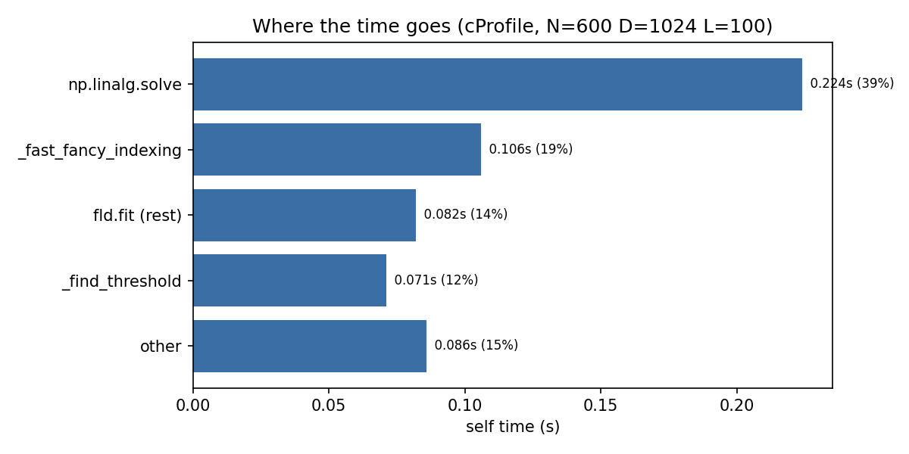
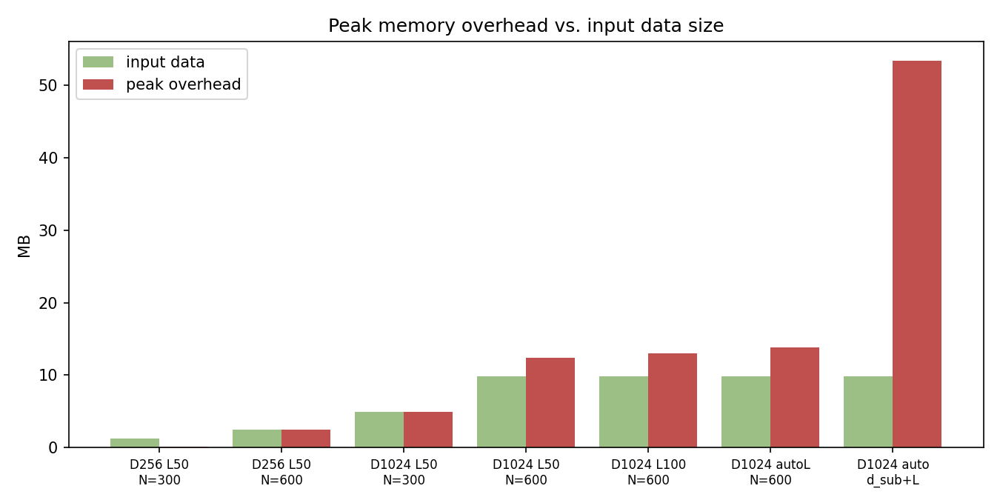
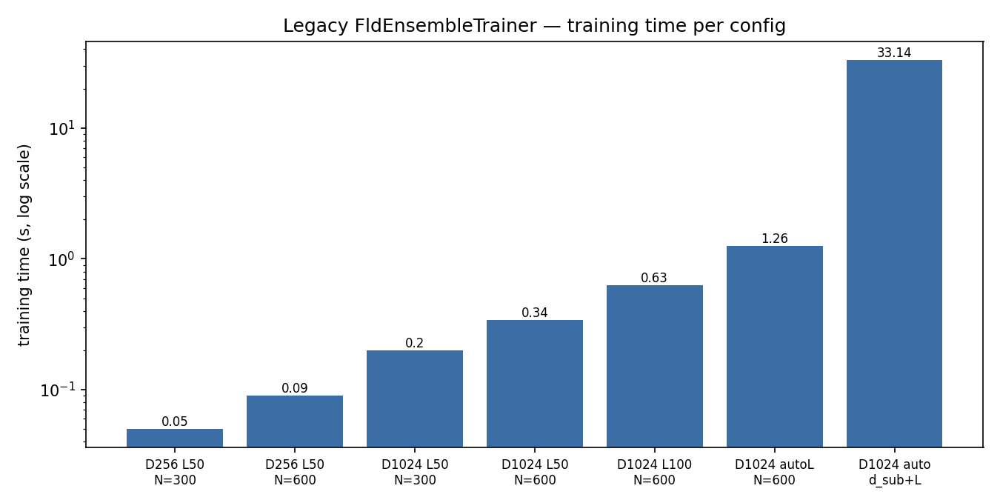

# FLD Ensemble Trainer — Benchmark & Optimization Report

Baseline measurements for the legacy `FldEnsembleTrainer` (sealwatch), used to set
optimization targets for a faster, more memory-efficient, scikit-learn-compatible
re-implementation.

## Goal

The legacy `FldEnsembleTrainer` is slow, memory-hungry, and uses a non-standard
interface (separate trainer/model classes, `Xc`/`Xs` instead of `(X, y)`,
`train()` instead of `fit`). Targets: (1) reduce training time, (2) reduce peak
memory, (3) provide a scikit-learn-compatible interface — while staying
bit-identical to the reference under a `matlab_compat` mode.

## Method

- Synthetic paired cover/stego features (Gaussian, weak signal in a few dims).
- Wall-clock time = median of 3 runs per config.
- Peak resident memory sampled in a background thread (`psutil`); reported as the
  increase over the pre-training RSS. `data (MB)` = size of the input `Xc`+`Xs`.
- Hotspots via `cProfile` (cumulative + self time) on one representative config.
- Hardware: <FILL: CPU, cores, RAM>. Python 3.12, NumPy <FILL>.

## Baseline results (legacy)

| Config                      | time (s) | peak mem (MB) | data (MB) | L   |
|-----------------------------|---------:|--------------:|----------:|----:|
| N=300  D=256   L=50  fixed  |     0.05 |           0.1 |       1.2 |  50 |
| N=600  D=256   L=50  fixed  |     0.09 |           2.5 |       2.5 |  50 |
| N=300  D=1024  L=50  fixed  |     0.20 |           4.9 |       4.9 |  50 |
| N=600  D=1024  L=50  fixed  |     0.34 |          12.4 |       9.8 |  50 |
| N=600  D=1024  L=100 fixed  |     0.63 |          13.0 |       9.8 | 100 |
| N=600  D=1024  auto L       |     1.26 |          13.8 |       9.8 | 209 |
| N=600  D=1024  auto d_sub+L |    33.14 |          53.4 |       9.8 | 268 |

### Hotspots (cProfile, N=600 D=1024 L=100, total 0.569 s self-time)

| Function                          | self time (s) | share |
|-----------------------------------|--------------:|------:|
| `np.linalg.solve` (FLD weights)   |         0.224 |  39 % |
| `_fast_fancy_indexing`            |         0.106 |  19 % |
| `fld.fit` (scatter, means, rest)  |         0.082 |  14 % |
| `_find_threshold` (Python loop)   |         0.071 |  12 % |
| other (train loop, OOB, setops)   |        ~0.086 |  16 % |

`base_learner.fit` accounts for **85 %** of total training time and is independent
per base learner — i.e. embarrassingly parallel.



  
 


## Interpretation

- **The cost lives in `fit`.** 85 % of time is per-learner FLD fitting, fully
  independent → parallelizable for a near-linear speedup on multi-core machines.
- **`solve` dominates and scales cubically** (`O(d_sub³)`). Harmless at the small
  `d_sub` used here, but at real steganalysis scale (SRM `d_sub` up to ~1000+) it
  becomes the bottleneck. The matrix is SPD (stabilized with `+εI`), so a Cholesky
  solve (`scipy.linalg.solve(..., assume_a="pos")`) is ~1.8× faster and closer to
  the Matlab reference (`mldivide`).
- **`_find_threshold` is a pure-Python loop** over all samples → vectorizable with a
  cumulative-sum sweep over sorted scores.
- **`_fast_fancy_indexing`** materializes an `(N, d_sub)` array twice per learner;
  this is intrinsic (the FLD needs the projected data) but drives the memory peak
  as `d_sub` grows.
- **Memory peak.** Fixed configs sit at ~1.3× the input size; the redundant
  `astype(np.float64)` copy (always copies, even when already float64) is ~1× of
  that. The `auto d_sub+L` run peaks at **5.4× data** because scatter (`d_sub²`) and
  the per-learner transients grow with `d_sub`. At SRM scale the redundant float64
  copy alone is ≈1.4 GB — the headline memory win.
- **The real cost driver is the search.** `auto d_sub+L` (33 s) is ~25–50× a single
  fixed run; this is the realistic baseline for "faster".

## Optimization targets

| Metric                 | Baseline        | Target            | Lever                                            |
|------------------------|-----------------|-------------------|--------------------------------------------------|
| Time (`auto d_sub+L`)  | 33 s            | 6–10 s (3–5×)     | joblib parallel fit + Cholesky                   |
| `solve` share          | 39 %            | ~20 %             | `scipy.linalg.solve(assume_a="pos")`             |
| `_find_threshold`      | 12 %            | <3 %              | vectorize (cumsum)                               |
| Peak memory            | 1.3–5.4× data   | 0.3–0.5× data     | `asarray` instead of `astype`; no double-hold    |
| Interface              | trainer+model   | sklearn `fit/predict/score`, `clone`-able | rewrite as `BaseEstimator`/`ClassifierMixin` |

Caveats: parallelism has fixed overhead and only pays off on large jobs (the sub-second
configs get *slower* in parallel) → `n_jobs=1` stays the default. The `(N, d_sub)`
transient is intrinsic; the clean memory win is removing the float64 copy (scales to
GB at SRM size).

## Results after optimization (to fill)

| Config                      | legacy (s) | new seq (s) | new ‖ (s) | speedup | legacy mem | new mem |
|-----------------------------|-----------:|------------:|----------:|--------:|-----------:|--------:|
| N=600 D=1024 auto d_sub+L   |      33.14 |       <FILL>|    <FILL> |  <FILL> |      53.4  |  <FILL> |

Bit-identity vs. legacy under `matlab_compat=True`: <FILL: PASS/FAIL>.

## Reproduce

```bash
python bench/benchmark_fld_ensemble.py     # timing/memory grid + cProfile
python bench/plot_benchmark.py             # figures into bench/figures/
```

### Optimazation Plan
Angepasste, sicherere Reihenfolge (Parallelität ans Ende, optional):

sklearn-Interface + asarray + bincount — bit-identisch → exakt validieren.
Cholesky-Solve in fld.py (der 39%-Posten) — wirkt überall, reproduzierbar. Ändert Numerik leicht → mit Toleranz validieren.
_find_threshold vektorisieren — berechnet denselben Schwellwert, nur ohne Python-Schleife → kann bit-identisch bleiben. Sauberer 12%-Win.
Optional float32-Pfad (Memory, nur Nicht-Compat).
Optional n_jobs (joblib) — maschinenabhängiger Bonus, Default 1.