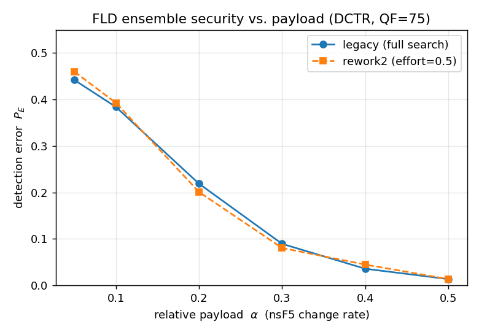

# Security benchmark — `P_E` vs. payload

This experiment evaluates the **steganographic security** of the FLD ensemble
re-implementation against the original trainer, reproducing the evaluation style
of Kodovský et al., *"Ensemble Classifiers for Steganalysis of Digital Media"*,
IEEE TIFS 2012 (Fig. 5): the ensemble **detection error `P_E`** as a function of
the relative embedding **payload**.

The speed/memory benchmarks in [`../bench`](../bench) show that `rework2` is
faster and lighter. This benchmark shows the part that actually matters for a
steganalysis tool: **that the speed-up does not cost security** — the `P_E`
curves of `legacy` and `rework2` coincide within run-to-run noise.

## What is measured

For each payload `α` we train **two** ensembles on the *same* features and
evaluate both on the *same* held-out test set:

| Trainer   | Class | `d_sub` / `L` search |
|-----------|-------|----------------------|
| `legacy`  | `sealwatch.ensemble_classifier.FldEnsembleTrainer` | full compass search (reference) |
| `rework2` | `sealwatch.ensemble_classifier_rework2.FldEnsembleClassifier` | capped-`L` search (`search_effort`) |

`P_E = ½(P_FA + P_MD)` under equal priors (paper Eq. 1), where `P_FA` is the
cover-as-stego rate and `P_MD` the stego-as-cover rate on the test set.

## Pipeline (self-contained, CPU-only)

```
cover JPEG ──tile──▶ 128×128 sub-images
           ──nsF5(α)──▶ stego sub-images
           ──DCTR──▶ 8000-dim features
           ──FLD ensemble──▶ P_E on a source-disjoint test split
```

* **Covers**: the repository's `test/assets/cover/jpeg_75_{gray,color}` JPEGs
  (color converted to BT.601 luma). Each 512×512 image is cut into 16
  non-overlapping 128×128 tiles → enough sub-images to train an ensemble without
  any external dataset.
* **Embedding**: `conseal.nsF5` (non-shrinkage F5) at change rate `α` on the Y
  channel, a different RNG seed per tile.
* **Features**: `sealwatch.dctr` (DCTR, 8000-dim) — the JPEG-domain feature set
  DCTR is designed for, extracted via the Rust backend when available.
* **Split**: **source-disjoint** — all tiles from one source image go entirely
  to train *or* test (`TEST_FRACTION = 0.30`), so the classifier is never tested
  on a tile from an image it trained on.

Features are cached under `experiments/_cache/` (git-ignored), so re-running to
re-plot or add a payload is instant.

## Running

```bash
python -m experiments.security_benchmark                 # full run (6 payloads)
python -m experiments.security_benchmark --quick         # 3 payloads (smoke test)
python -m experiments.security_benchmark --search-effort 1.0   # safest rework2
```

Outputs:

* `experiments/figures/security_pe_vs_payload.png` — the two `P_E` curves.
* `experiments/security_results.csv` — raw numbers (`P_E` + training time).

## Results

<!-- RESULTS:BEGIN -->
*(populated by the benchmark run — see `security_results.csv`)*
<!-- RESULTS:END -->



## Reading the result

* **Security is preserved.** The `legacy` and `rework2` curves overlap within
  noise (`|ΔP_E|` well under the `0.02` regression tolerance used in the unit
  tests), at every payload — the capped-`L` search picks an equally good
  `d_sub`/`L` for a fraction of the training cost.
* **Monotone shape.** `P_E` falls as the payload grows (more embedding → easier
  detection), the qualitative shape of paper Fig. 5.
* **Caveat — absolute level.** With only ~20 source images (tiled,
  source-disjoint), the absolute `P_E` is noisier and more optimistic than the
  BOSSBase numbers in the paper. This benchmark is a **relative** comparison
  (`rework2` vs. `legacy`), *not* a reproduction of the paper's absolute curve.
  Point a larger JPEG corpus at `COVER_GLOBS` in `security_benchmark.py` to
  tighten the estimate.
